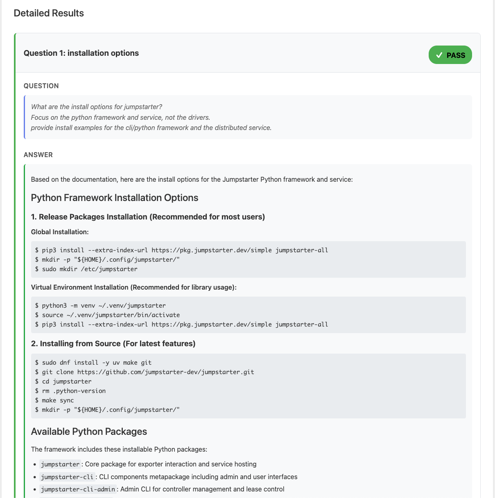

# Doc-Check

A CLI tool for checking documentation quality using LLM-based Q&A evaluation. The purpose of this tool
is to explore the capabilities of LLMs in evaluating documentation quality by asking specific questions
and assessing the answers against predefined criteria.

It is designed to integrate with OpenAI, Anthropic, and Ollama models, allowing users to specify
the model and provider directly in the configuration file or via command line options.

It also supports RAG (Retrieval-Augmented Generation) for large documents, enabling the model to
retrieve relevant chunks of text instead of processing the entire document at once, with fallback
to the full document if necessary.

## Warning

This project has been fully vive-coded using claude-sonnet-4-20250514, and aider in a couple of days
because of this, I don't feel in a position to claim any license for it, so I am just leaving it as is,
use or fork at your own risk...

## Preview


Question and answer


Evaluation


## Installation

### Example HTML

### Using uv (recommended)

```bash
# Install uv if you haven't already
curl -LsSf https://astral.sh/uv/install.sh | sh

# Create and activate virtual environment
uv sync
source .venv/bin/activate
```

## Usage

### Commands

Doc-Check provides two commands:

- `doc-check check`: Check documentation quality using LLM evaluation
- `doc-check validate`: Validate configuration file format

### Basic Usage

1. Create a `doc-check.yaml` configuration file:

```yaml
file: README.md
questions:
  - name: installation
    question: How do I install this software?
    answerEvaluation: |
      The answer should provide clear installation instructions, including:
      - Prerequisites or system requirements
      - Step-by-step installation commands
      - How to verify the installation worked
```

2. Set your API key (OpenAI, Anthropic, or use Ollama locally):

```bash
export OPENAI_API_KEY="your-api-key-here"
# OR
export ANTHROPIC_API_KEY="your-api-key-here"
# OR use Ollama locally (no API key needed)
```

3. Run the check:

```bash
doc-check check examples/jumpstarter-check.yaml
```

### Configuration File Options

You can specify model, provider, and other settings directly in your configuration file:

```yaml
file: README.md

# Model and provider settings (optional - can be overridden by CLI)
provider: anthropic
model: claude-sonnet-4-20250514
# api_key: your-key-here  # Better to use environment variables

# Summarization settings (optional)
summarize: medium
summarizer_model: claude-sonnet-4-20250514

# RAG settings for large documents (optional)
use_rag: true
rag_chunk_size: 1024
rag_chunk_overlap: 100
rag_top_k: 8
rag_fallback: true

# Debug settings (optional)
verbose_dialog: false
debug: false

questions:
  - name: installation
    question: How do I install this software?
    answerEvaluation: |
      The answer should provide clear installation instructions, including:
      - Prerequisites or system requirements
      - Step-by-step installation commands
      - How to verify the installation worked
      - Provide at least this example: ./my-install-method.sh
```

CLI options always override configuration file settings.

### Check Command Options

#### Core Options
- `--api-key`: API key (alternative to environment variable)
- `--model`: Model to use (auto-detects provider from model name)
- `--provider`: Explicitly specify provider (openai, anthropic, or ollama, default: openai)
- `--verbose, -v`: Show detailed output including full answers
- `--verbose-dialog`: Show questions and answers in real-time as they are processed
- `--debug`: Show detailed debug information including prompts sent to the model

#### Output Options
- `--output, -o`: Save results to file (JSON/YAML based on extension)
- `--format`: Output format (json, yaml, html, or auto - auto-detects from file extension)
- `--output-format`: Additional output format (html or junit)
- `--output-dir`: Directory for additional output files (default: current directory)

#### Document Processing Options
- `--summarize`: Summarization level (minimal, light, medium, aggressive, cleanup)
- `--summarizer-model`: Model to use for document summarization (default: claude-sonnet-4-20250514)

#### RAG (Retrieval-Augmented Generation) Options
- `--use-rag`: Use RAG to provide only relevant document chunks to the model
- `--rag-chunk-size`: Size of each document chunk for RAG indexing (default: 512)
- `--rag-chunk-overlap`: Overlap between chunks for RAG indexing (default: 50)
- `--rag-top-k`: Number of top relevant chunks to retrieve for each question (default: 5)
- `--rag-fallback`: Retry with full document if RAG-based answer fails evaluation

### Validate Command

Validate your configuration file:

```bash
doc-check validate doc-check.yaml
```

## Examples

```bash
# Basic check with verbose output
doc-check check doc-check.yaml --verbose

# Save results to JSON file
doc-check check doc-check.yaml --output results.json

# Use specific model and provider (overrides config file)
doc-check check doc-check.yaml --model gpt-4.1 --provider openai

# Use Anthropic Claude
doc-check check doc-check.yaml --model claude-sonnet-4-20250514

# Use local Ollama model (no API key needed)
doc-check check doc-check.yaml --model llama3.2 --provider ollama

# Summarize document before checking (for large documents)
doc-check check doc-check.yaml --summarize minimal

# Use RAG for large documents with fallback
doc-check check doc-check.yaml --use-rag --rag-fallback --rag-chunk-size 1024

# Generate HTML report
doc-check check doc-check.yaml --output-format html

# Debug mode to see prompts
doc-check check doc-check.yaml --debug

# Validate configuration only
doc-check validate doc-check.yaml
```

## Supported Models and Providers

Doc-Check supports OpenAI, Anthropic, and Ollama models with automatic provider detection:

### OpenAI Models
- `gpt-4.1` (default for OpenAI)
- `gpt-4.1-mini`
- `gpt-4.1-nano`
- `gpt-4o`
- `gpt-4o-mini`
- `gpt-4.5-preview`

### Anthropic Models
- `claude-sonnet-4-20250514` (default for Anthropic)
- `claude-3-5-sonnet-20241022`
- `claude-3-sonnet-20240229`
- `claude-3-haiku-20240307`

### Ollama Models (Local)
- `llama3.2` (default for Ollama)
- `llama3.1`
- `mistral`
- `mixtral`
- `codellama`
- `phi3`
- `gemma`

The provider is automatically detected from the model name, or you can specify it explicitly with `--provider`. Settings in the configuration file are used as defaults, but CLI options always override them.

## Configuration Format

### Required Fields
- `file`: Path to the document to check (relative to config file) or URL
- `questions`: List of questions with:
  - `name`: Unique identifier for the question
  - `question`: The question to ask about the document
  - `answerEvaluation`: Criteria for evaluating the answer

### Optional Configuration Fields

All of these can be overridden by CLI options:

#### Model and Provider Settings
- `provider`: API provider ("openai", "anthropic", or "ollama")
- `model`: Model name to use for evaluation
- `api_key`: API key (better to use environment variables)

#### Document Processing
- `summarize`: Summarization level ("minimal", "light", "medium", "aggressive", "cleanup")
- `summarizer_model`: Model to use for document summarization

#### RAG Settings
- `use_rag`: Enable RAG for large documents (boolean)
- `rag_chunk_size`: Size of document chunks (integer)
- `rag_chunk_overlap`: Overlap between chunks (integer)
- `rag_top_k`: Number of chunks to retrieve (integer)
- `rag_fallback`: Retry with full document if RAG fails (boolean)

#### Debug and Output
- `verbose_dialog`: Show questions/answers in real-time (boolean)
- `debug`: Show detailed debug information (boolean)

See the `examples/` directory for complete configuration examples.
